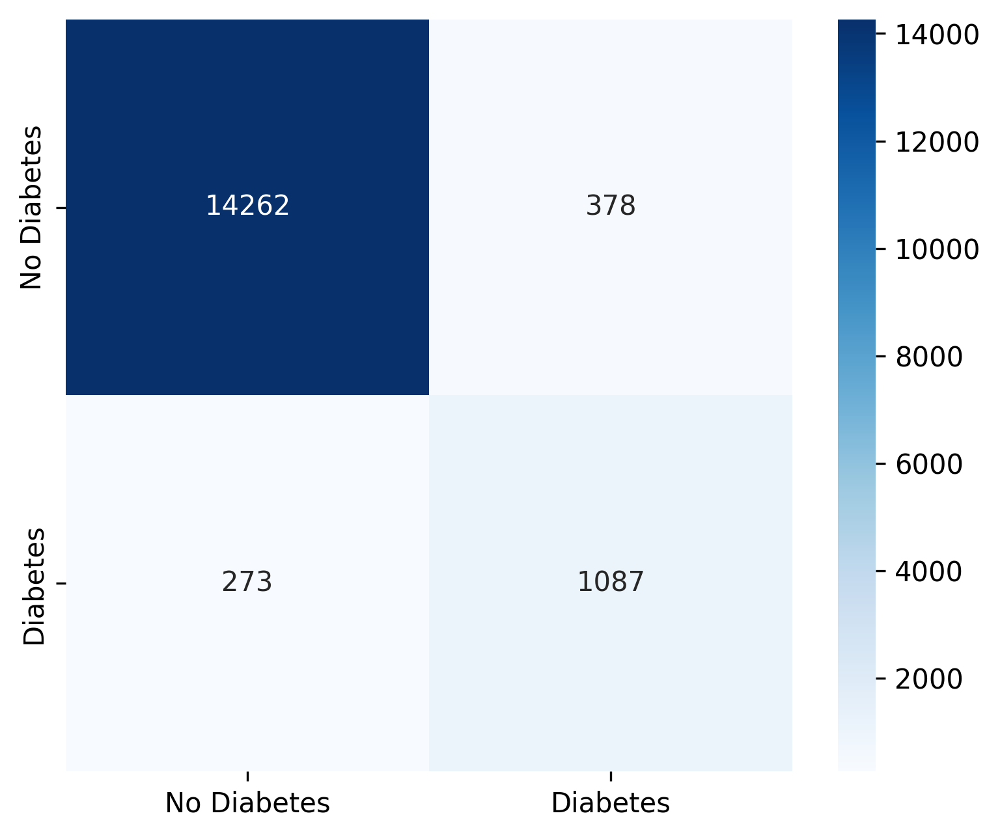

# Diabetes Prediction using Machine Learning

## Overview

This project develops a machine learning model for predicting diabetes using patient health indicators.

The project follows a complete Data Science workflow including:

- Exploratory Data Analysis (EDA)
- Feature Engineering
- Data Preprocessing
- Model Training
- Hyperparameter Optimization
- Model Evaluation
- Experiment Tracking with MLflow
# Start MlFlow / You can check all experiments
mlflow ui --backend-store-uri sqlite:///mlflow.db --port 5001

The objective is to build a reliable binary classification model capable of identifying patients at risk of diabetes while maintaining a good balance between precision and recall.

---

## Dataset

The project uses publicly available diabetes datasets containing demographic and medical information such as:

- Age
- Gender
- BMI
- Hypertension
- Heart disease
- Smoking history
- HbA1c level
- Blood glucose level

Target variable:

- **diabetes**
    - 0 → No diabetes
    - 1 → Diabetes

---

## Project Structure

```
SU_ML_RETAKE_EXAM_2026
│
├── data
│   ├── raw
│   └── processed
│
├── models
│
├── notebooks
│   ├── 01_overview.ipynb
│   ├── 02_eda.ipynb
│   ├── 03_feature_engineering.ipynb
│   └── 04_modeling.ipynb
│
├── reports
│   └── figures
│
├── source
│   ├── data
│   ├── features
│   ├── helper
│   ├── models
│   └── visualization
│
└── README.md
```

---

## Workflow

### 1. Exploratory Data Analysis

The dataset was analyzed to understand:

- missing values
- class distribution
- feature distributions
- correlations
- outliers
- relationships between medical variables

Visualizations include:

- Histograms
- Correlation matrices
- Q-Q plots
- Class distributions

---

### 2. Feature Engineering

Several preprocessing steps were applied:

- One-Hot Encoding for categorical variables
- Standardization of numerical features
- Dataset transformation using Scikit-Learn pipelines
- Train / Validation split

---

### 3. Modeling

The project uses a **Random Forest Classifier**.

Hyperparameters were optimized using **GridSearchCV**.

Several combinations of:

- number of trees
- tree depth
- minimum samples
- class weights

were evaluated to improve the model's ability to detect diabetes cases.

---

### 4. Threshold Optimization

Instead of using the default probability threshold (0.50), multiple decision thresholds were evaluated.

This allows improving recall for the minority class while controlling the number of false positives.

---

### 5. Model Evaluation

The model was evaluated using:

- Accuracy
- Precision
- Recall
- F1-score
- Confusion Matrix
- Feature Importance

Special attention was given to Recall because correctly identifying diabetic patients is more important than maximizing overall accuracy.

---

## Experiment Tracking

MLflow was used for:

- experiment logging
- hyperparameter tracking
- metric comparison
- model artifact storage

---

## Technologies

- Python
- Pandas
- NumPy
- Scikit-Learn
- Matplotlib
- Seaborn
- MLflow
- Jupyter Notebook

---

## Results

The final Random Forest model achieved strong overall performance while maintaining good generalization on both the test and validation datasets.

Threshold tuning further improved the model's ability to identify diabetic patients by increasing recall for the positive class.

Feature importance analysis also showed that medical indicators such as HbA1c level and blood glucose level have the greatest influence on model predictions.

### Experiment 3

Classification Report:
              precision    recall  f1-score   support

         0.0       0.98      0.97      0.98     14640
         1.0       0.72      0.80      0.76      1360

    accuracy                           0.96     16000
   macro avg       0.85      0.89      0.87     16000
weighted avg       0.96      0.96      0.96     16000



